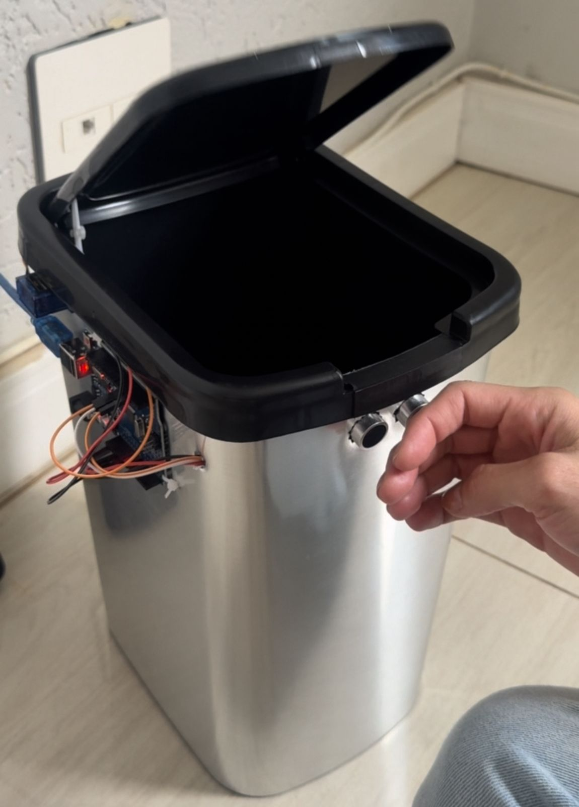

# ♻️ Lixeira Automatizada com Arduino

Este projeto consiste em uma **lixeira automatizada controlada por Arduino**, que utiliza um **sensor ultrassônico** para detectar a aproximação de objetos (como uma mão) e acionar automaticamente a abertura da tampa por meio de um **servo motor**.

Foi desenvolvido por **Ana Caroline Leal do Nascimento** e **Fabrício** como um exercício prático de **automação, eletrônica e programação embarcada**.


---

## 🧠 Objetivo do Projeto

O objetivo principal foi aplicar conceitos de **programação em Arduino**, **sensoriamento** e **automação**, criando uma solução simples, funcional e de baixo custo para o uso cotidiano.

Além disso, o projeto buscou reforçar habilidades de:
- Lógica de programação e controle de fluxo;
- Integração entre hardware e software;
- Trabalho em equipe e prototipagem.

---

## ⚙️ Componentes Utilizados

- **Arduino Uno R3**
- **Sensor ultrassônico HC-SR04**
- **Servo motor SG90**
- **Jumpers (fios de conexão)**
- **Protoboard**
- **Lixeira com tampa basculante**
- **Fonte de alimentação USB ou externa**

---

## 🔌 Funcionamento

1. O sensor ultrassônico mede a distância entre ele e o objeto à sua frente.  
2. Quando a distância é menor que um valor pré-definido (por exemplo, 15 cm), o Arduino envia um sinal para o servo motor.  
3. O servo motor gira e **abre a tampa automaticamente**.  
4. Após alguns segundos, o motor retorna a posição inicial e a tampa **se fecha sozinha**.

---

## 💻 Código-fonte

O código foi desenvolvido na **IDE Arduino**, utilizando a biblioteca Servo.h.

```cpp
#include <Servo.h>

Servo servo_9;

long readUltrasonicDistance(int triggerPin, int echoPin){
  pinMode(triggerPin, OUTPUT);
  digitalWrite(triggerPin, LOW);
  delayMicroseconds(2);
  digitalWrite(triggerPin, HIGH);
  delayMicroseconds(10);
  digitalWrite(triggerPin, LOW);
  pinMode(echoPin, INPUT);
  return pulseIn(echoPin, HIGH);
}
 
void setup(){
  Serial.begin(9600);
  servo_9.attach(5, 500, 2500);
  Serial.println("Lendo dados do sensor...");
}

int cm = 0;
#define ABERTO 5
#define  FECHADO 120

void loop(){
  cm = 0.01723 * readUltrasonicDistance(4, 3);
  delay(100);

  if (cm <= 5){
    Serial.println("Abrindo...");
    servo_9.write(ABERTO);
    delay(3000);
  }
  Serial.println("Fechando...");
  servo_9.write(FECHADO);
}
```

## Fotos




## Autores

* **Ana Caroline** - [anac_roline](https://github.com/anac-roline)
* **Fabrício** - [FabricioLR](https://github.com/FabricioLR)

